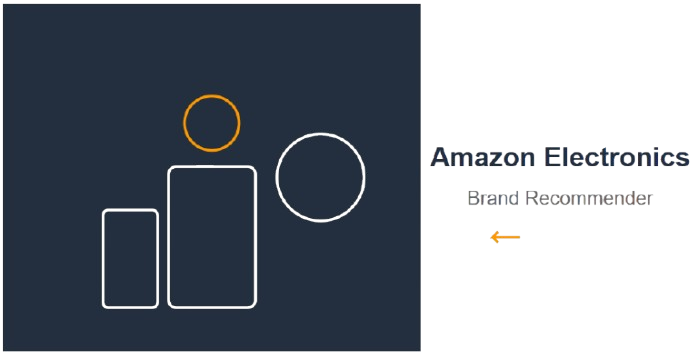

# 🎯 Amazon Electronics Brand Analysis & Recommendation System



## 📊 Project Overview
Advanced data analysis and machine learning project for Amazon electronics products, featuring brand analysis, price prediction, and intelligent recommendation system.

## 🚀 Features
- **Brand Strategy Analysis**: Premium, Value, and Budget brand categorization
- **Price Prediction Modeling**: Machine learning price forecasting
- **Intelligent Recommendation System**: 3 types of recommendations
- **RESTful API**: Ready-to-deploy recommendation API

## 📁 Project Structure
```
amazon-brand-analysis/
├── data/ # Cleaned dataset
├── notebooks/ # Jupyter notebooks (full analysis)
├── src/ # Source code and API
├── docs/ # Documentation and visuals
├── requirements.txt # Python dependencies
└── README.md # Project documentation
```

## 🛠️ Installation
```bash
git clone https://github.com/alielastal/amazon-brand-analysis.git
cd amazon-brand-analysis
pip install -r requirements.txt
```

## 📊 Results Highlights
HP: Premium quality leader ($61.64, 4.7⭐)

JJC: Best value proposition ($11.86, 4.5⭐)

5+ strategic brand categories identified

269 products across 229 brands analyzed

## 🌐 API Endpoints

- `GET /` - API root with endpoint information
- `GET /health` - Health check endpoint
- `GET /api/v1/products` - Get products with filtering options
- `GET /api/v1/products/{id}` - Get specific product by ID
- `GET /api/v1/brands` - Get all available brands
- `GET /api/v1/categories` - Get all product categories
- `GET /api/v1/recommendations/content-based/{id}` - Content-based product recommendations
- `POST /api/v1/recommendations/user-based` - User preference-based recommendations
- `GET /api/v1/recommendations/strategy-based/{type}` - Strategy-based recommendations
- `GET /api/v1/stats/price-distribution` - Price statistics and distribution
- `GET /api/v1/stats/brand-stats` - Brand performance statistics


## 🤝 Contributing
Feel free to fork and contribute to this project!
